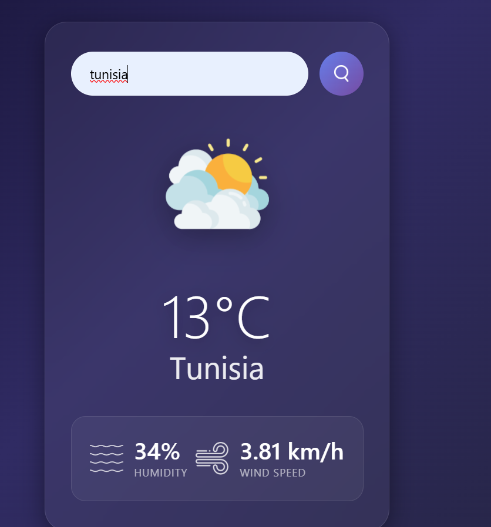

# weather-app
Application web permettant de consulter la météo en temps réel via une API externe 

## Apercu 
Application météo simple qui récupère les données d'une API  (OpenWeatherMap) et les affiche . Projet réalisé pour comprendre l'entégration d'API REST . 

## Technologies utilisées 

-**Frontend** : HTML , CSS , JAVASCRIPT 

-**Requetes** : Fetch API (async / await ) 

## Interface de l'utilisateur 

## Fonctionnalités 

-**recherche par ville**

-**Données temps réel** 

-**Icones dynamiques** 

## Api intégrée 

-**Service** : openweathermap 

-**Endpoint** : https://api.openweathermap.org/data/2.5/weather 

-**Données récupérées** 
``json 

     { "main" : {"temp" : 22.5 , "humidity" : 65 } ,
     "wind" : {"speed": 5.2} , 
     "weather": [{"main" : "clouds"}] , 
     "name": "paris" 
     } 
  

